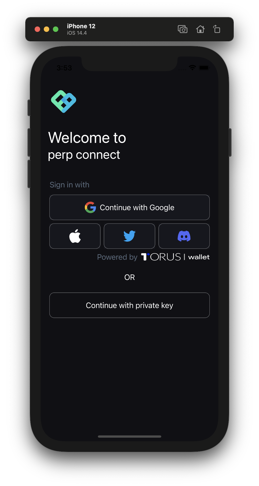
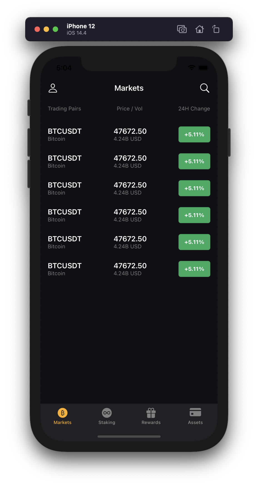

# Perpetual Connect

SwiftUI based iOS app for trading and managing positions on perpetual protocol.

## Screenshots

### iOS

Login | App |
--- | --- |
 | 

## Features:

- [x] Sign in features with (Google, Discord, Twitter, Apple)
- [ ] private key & seed phrase scanning with a phone camera directly in the app
- [ ] View all your long, short positions
- [ ] One click to close all the open positions (for emergencies)
- [ ] Stake perp inside the app
- [ ] View historical price action on a tradingview chart integrated in the app.
- [ ] biometrics authentication
- [ ] PIN code lock
